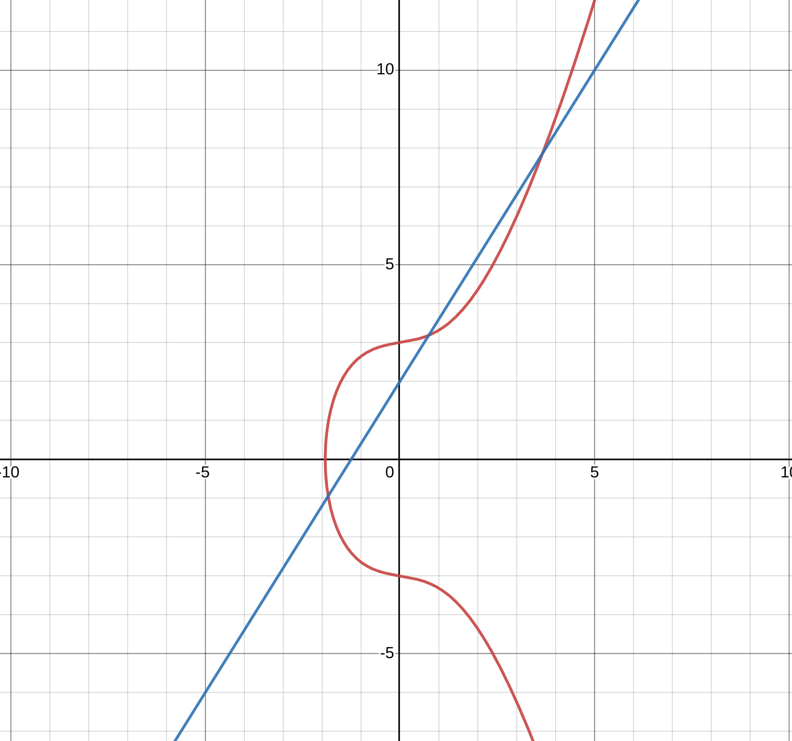
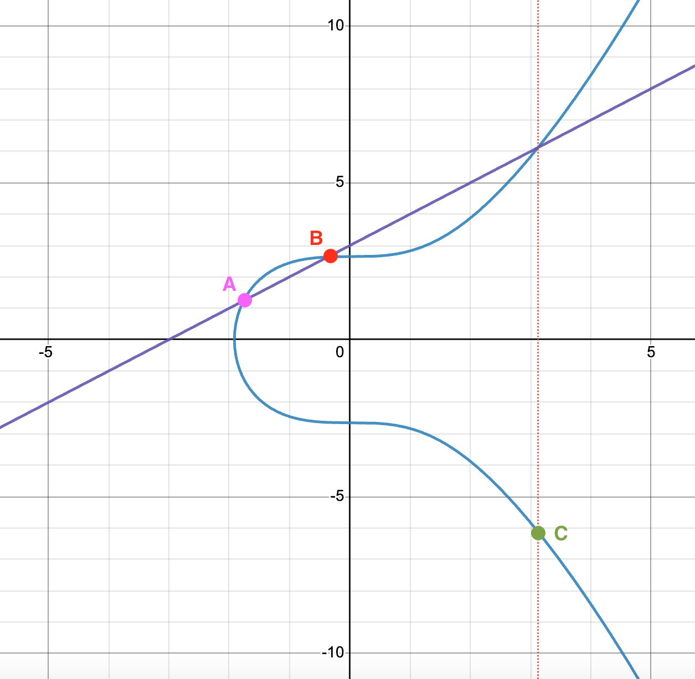
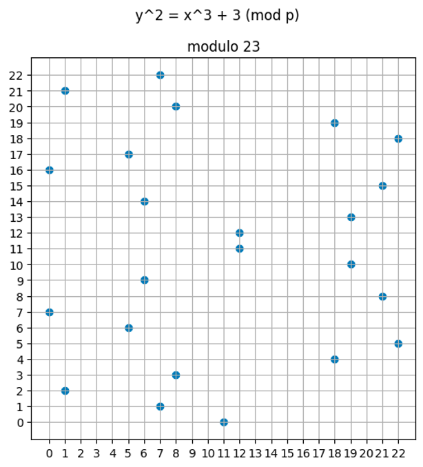

# Zero Knowledge Prover of Valid Solutions to Linear Systems of Equations

This repository implements a suggested excercies from chaper 5 of this book on zero knowledge proofs: [https://www.rareskills.io/zk-book](https://www.rareskills.io/zk-book)

The task is to take advantage of the group homomorphism between standard artithmetic and eliptic curve point addition in order to implement a basic zero knowledge prover for valid solutions of linear systems of equations.

# Theory/Math

To consoldate my understanding, and offer insight into what the code in this project is actually doing, I'm going to briefly describe the math that is involved in this zk prover:

## ZK

A *zero knowledge proof* allows you to verify that some program was executed correctly without revealing inputs or state during computation. 

## Finite Fields

A field $A$ is a type of set with two binary operators. Under the first binary operator, the set is an abelian group. And under the second binary op, it is an abelian group only when the zero element is excluded.

Abelian groups have the following properties: (I am using $\oplus$ to represent the binary op)
- Closure: $\forall a, b \in A, \ (a \oplus b) \in A$
- Associativity: $\forall a, b, c \in A, \ (a \oplus b) \oplus c = a \oplus (b \oplus c)$
- Identity: $\exists e \in A \mid \forall a \in A, \ a \oplus e = a \land e \oplus a = a$
- Inverse: $\forall a \in A, \exists b \in A \mid a \oplus b = e \land b \oplus a = e$
- Commutativity: $\forall a, b \in A, \ a \oplus b = b \oplus a$

The set of $\mathbb{R}$ under the binary operators of addition and multiplication is a finite field. Under addition, all the above properties hold true. Under multiplication, they only hold true if zero is excluded. 

The zk implementation in this repo uses elliptic curve point addition over a finite field. $\leftarrow$ lets address the finite field part of that sentence: 

A finite field, also called a Galois field, is a field with a finite number of elements. Integers modulo a prime number are an example of this. $\mathbb{Z}/\mathbb{pZ}=\{0, 1, 2, 3, 4, 5, 6, 7, 8, 9, 10, 11\}$ where p=11 can be likened to a clock face with hours from 0-11. By adding/multipying "hours" to a given field element, all field elements can be generated. That property makes $\mathbb{Z}/\mathbb{pZ}$ a *cyclic group* under each of its ops as well, because all field elements can be obtained by repeated applicated of the field operators onto some  generator element $\mathbb{G}$.

## Eliptic Curve Point Addition Over a Finite Field

As mentioned above, we are going to be using elliptic curve point addition over a finite field. $\leftarrow$ Now lets address the elliptic curve point art of that senetence.

Eliptic curves are a family of function of the form: $y^2 = x^3 + ax + b$

  

Above is a plot of $y^2 = x^3 + x + 9$ as well as $y=2+1.6x$.

The cool thing about eliptic curves is that if a line intersects two points, then it must intersect a third. With the exception of a verical line. Eliptic curve point addition is a binary operator that relates inputs of two points on the curve with the third point. To satisfy the abelian group rules, another point called the *point at infinity* is added to the set to enable the property of closure for vertical lines. The point at ininity is also the zero element. 

  

As well, the field is defined such that the third term is not the actual third connection point, but its reflection across the x axis. This is to allow the following algebraic manipulation to remain true:

$a \oplus b = c$  
$b \oplus c = a$  
$(b \oplus c) \oplus b = c$  
$b \oplus c  = c\oplus \text{Inverse}(b)$  
$b =  \text{Inverse}(b)$  

For eliptic curve point addition under a finite field, we modulo by a prime. $y^2 = x^3 + ax + b$ (mod p). This makes the field cyclic and means $y$ will not exceed the modulus.

  

Above is a plot $y^2 = x^3+3$ (mod 23)

## Group Homomorphisms for a Zero Knowledge Proof

An important note is that the two binary ops in our finite field are curve point addition and curve point multiplication (which is really just repeated curve point addition). Because we know the group is cyclic, this means that there is a homomorphism between adding two field elements together and adding together two generators $\mathbb{G}$ each multiplied by the scalar x value of those field elements respectively. (Homomorphism is being used to mean that there is a "one way" preservation of information between two structures. In this case, the multiplicative structure. That is, it is easy to convert between one structure to another, but not the other way around). For example, with the set of all integers mod 11:

$5\mathbb{G} + 7\mathbb{G}$ (mod 11) where $\mathbb{G}$ is 1, is homomorphic to $\mathbb{5 + 7}$ (mod 11) 

This example is also an isomorphism (a two way preservation of information). But in order to construct a homomorphism for cryptography, it needs to be very difficult to inverse the homomorphism. 

We can construct a basic zero knowledge proof using elliptic curve cryptography by taking advantage of such a homomorphism. For example, if I want to prove to you that I know two secret numbers x and y that when added together equal 15, we can set up the following zk proof.

- Claim: "I know an $x$ and a $y$ such that  $x + y = 15$

- Proof: I present to you $x\mathbb{G}$ and $y\mathbb{G}$ as $A$ and $B$

- Verification: You verify that $15\mathbb{G}$ is the same as $A + B$

This proof ensures that I do know an x and y with the desired property by showing they have that property in a way that keeps their true values obfuscated in eliptic curve space. Assuming the modulus is large enough, a brute force attack to learn x and y is cryptographically infeasible.